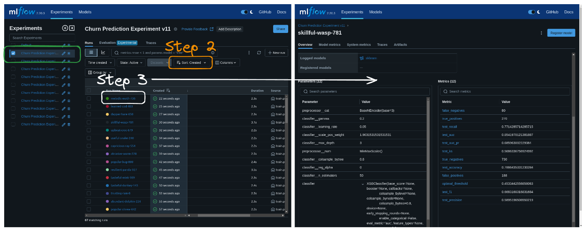

# Customer Churn

## About

Machine learning project to practice customer churn analysis and explore topics such as class imbalance, optimal evaluation metrics and model calibration in classification context. This projects use MLFlow to track and compare experiments.

## Usage

### 1. Download raw data

This [Kaggle](https://www.kaggle.com/datasets/blastchar/telco-customer-churn) Customer Churn Dataset contains data to predict customer's retention. Follow the instructions:

1. Install the required libraries by running `pip install -r requirements.txt`
2. Create a `.env` file with your Kaggle credentials (`username and key`) in root folder. You can find this credentials [here](https://www.kaggle.com/docs/api#getting-started-installation-&-authentication) 
3. Run the script by executing `python src/data_loader.py`
4. The raw data will be downloaded and saved in the `data/raw/` directory

### 2. Split train and test data

Run the script `python src/data_split.py`

### 3. Exploratory Data Analysis (if needed)

Open and run the notebook `01-exploratory-data-analysis.ipynb` 

### 4. Train the model

This project uses classification models such as Logistic Regression, Decision Tree and XGBoost. Our metric to optimize is the **f1-score**, because I want to garantee a high recall and a good precision. 

In MLFlow we will track others metrics: 

- AUC (Area Under the Curve)
- AUC-Precision-Recall (AUC-PR)
- Kolmogorov-Smirnov score
- Confusion matrix metrics:
  - True positives
  - False positives
  - True negatives
  - False negatives
- Accuracy
- Optimal threshold -> This is not a metric but we can monitoring

In training, I use RandomSearch to find the best parameters for each model. By default, I'm using 20 iterations per model. If you want to change the number of iterations, you can change the `n_iter` parameter in the `parameters.yml`.

In `src/utils_modelling.py` you can find the functions and change the parameters of models and encoders. The functions are:

- `get_encoders`: dictionary of encoders. 
- `get_models_and_param_grids`: dictionary of models and parameter grids

To train the models:

1. Run the script `python src/train.py`. You will see the models running like "**Combinação 19/20 para XGBClassifier**"
2. In your cmd/bash run `mlflow ui` to open MLFlow UI. And open `http://127.0.0.1:5000` in your browser. You can see all the experiments and metrics, as shown in the image.

3. Click in the experiment "Churn Prediction Experiment v11"
4. To see the best model, sort by f1-metric and click in the best model
5. You will see the metrics of the best model

## TODOs

- [x] "Data exploration"
- [x] Feature engineering
- [x] Model training
- [ ] Model evaluation
- [ ] Model calibration
- [ ] Translate 100% to english
- [ ] Documentation all functions
- [ ] Model deployment -> API + Docker + AWS
- [ ] Model monitoring
- [ ] Deployment monitoring